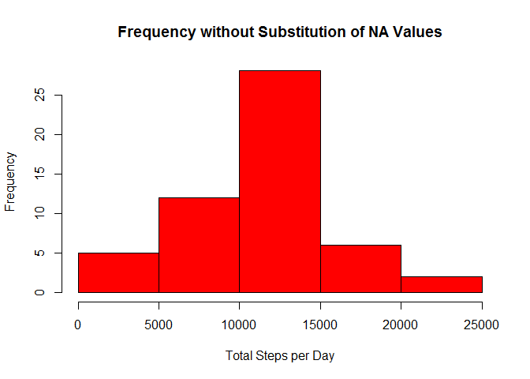
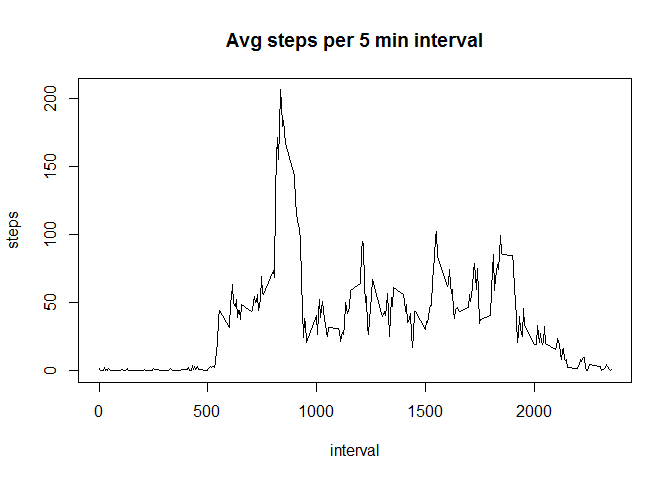
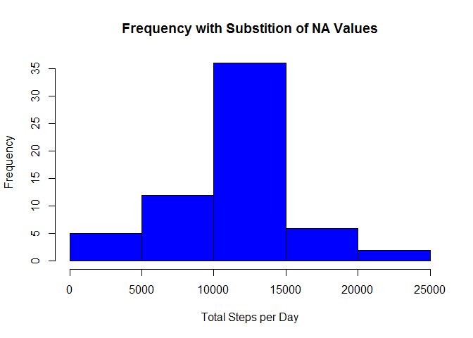

# Reproducible Research: Peer Assessment 1

## Load and process the data for project 1.  
Data is loaded into the file "actRaw""; processing consists of eliminating NA rows and copying content to file "active""


```r
actRaw<-read.csv("activity.csv")
active<-actRaw[!is.na(actRaw$steps),]
```

## What is the mean total number of steps per day?  
1.  Calculate total steps per day  
2.  Create a histogram of the total steps per day  
3.  Calcualte the mean  
4.  Calculate the median  


```r
nosubSum<-tapply(active$steps, active$date, sum) #1 TOTAL NUMBER OF STEPS PER DAY
hist(nosubSum, ylab = "Frequency", xlab = "Total Steps per Day", main = "Frequency without Substitution of NA Values", col = "red") #2 HISTOGRAM OF TOTAL STEPS PER DAY
```

 

```r
mean(nosubSum, na.rm = T) #3 MEAN OF TOTAL NUMBER OF STEPS PER DAY
```

```
## [1] 10766.19
```

```r
median(nosubSum, na.rm = T) #4 MEDIAN OF TOTAL NUMBER OF STEPS PER DAY
```

```
## [1] 10765
```

## What is the average daily activity pattern?  
1.  Plot time intervals by average steps taken    
2.  Identify the interval with the greatest average for number of steps  


```r
actMean<-tapply(active$steps, active$interval, mean)
plot(unique(active$interval),actMean , xlab = "interval", ylab = "steps", main = "Avg steps per 5 min interval", type = "l") #1 TIME INTERVALS BY AVERAGE STEPS TAKEN
```

 

```r
which.max(actMean) #2 INTERVAL WITH GREATEST AVERAGE NUMBER OF STEPS, ROW NUMBER OF FIRST INSTANCE
```

```
## 835 
## 104
```

## Inputting missing values:  
1. Calculate and report on number of missing values  
2. Fill in missing values with average value by interval  
3. Create a dataset with substituted missing values  
4. Plot histogram of the frequency of steps for the new dataset  
5. Calculate the mean  
6. Calculate the median  
Note:  filling in the missing values has shifted the median to the mean, eliminating the impact of the skew found in the original data


```r
sum(is.na(actRaw$steps)) #1 SUM OF NA VALUES
```

```
## [1] 2304
```

```r
subPrc<-actRaw #2 CREATE COPY OF DATA
missing<-unique(actRaw$date[is.na(actRaw$steps)])
for(i in missing) { #3 POPULATE NA VALUES WITH INTERVAL AVG
  subPrc$steps[subPrc$date == i]<-actMean}
subSum<-tapply(subPrc$steps, subPrc$date, sum)#4 TOTAL STEPS/DAY
hist(subSum, ylab = "Frequency", xlab = "Total Steps per Day", main = "Frequency with Substition of NA Values", col = "blue") #4 HISTOGRAM
```

 

```r
mean(subSum) #5 MEAN GIVEN REPLACEMENT OF NA VALUES
```

```
## [1] 10766.19
```

```r
median(subSum) #6 MEDIAN GIVEN REPLACEMENT OF NA VALUES
```

```
## [1] 10766.19
```

```r
##DEMONSTRATING THAT REPLACEMENT OF NA'S  DISTORTS THE ORIGINAL SKEW IN THE DATA
```

## Are there differences in activity patterns for weekends and weekdays?  
1. Create a factor variable denoting weekdays and weekends  
2. Plot steps by interval for weekends and weekdays  


```r
library(lattice)
active$weekdays<-weekdays(as.Date(active$date)) #1 
active$weekdays<-ifelse(active$weekdays == "Saturday" | active$weekdays == "Sunday", "weekend", "weekday") #1 CREATE WEEKDAY FACTOR VARIABLE

actSum<-aggregate(active$steps, by = list(active$interval, active$weekdays), data = active, FUN = mean)
xyplot(x ~ Group.1 | Group.2, data = actSum, xlab = "interval", ylab = "steps", type = "l", layout = c(1,2)) #2 LATTICE PLOT OF STEPS BY INTERVAL FOR WEEKENDS AND WEEKDAYS
```

 
